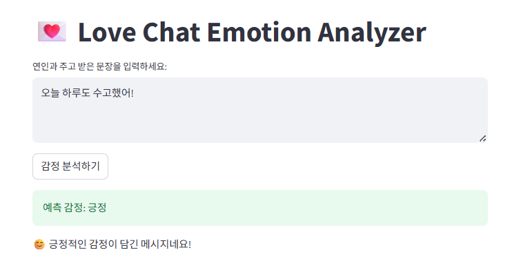
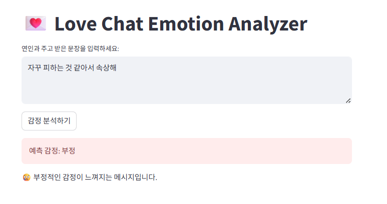
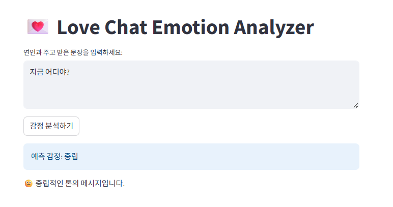

# 💌 Love Chat Emotion Analyzer

연인과 주고받은 채팅 메시지의 감정을 분석하는 웹 애플리케이션입니다.

## 🎯 주요 기능

- 채팅 메시지 입력 시 감정 분석 (긍정/부정/중립)

## 🛠️ 기술 스택

- Python 3.x
- Streamlit (웹 인터페이스)
- scikit-learn (머신러닝)
- TF-IDF (텍스트 벡터화)
- Logistic Regression (감정 분류)

## 📊 모델 성능

### 초기 성능 (40개 데이터)
```
accuracy: 0.38 (38%)
- 긍정: precision 0.40, recall 0.50
- 부정: precision 1.00, recall 0.33
- 중립: precision 0.00, recall 0.00
```

### 개선된 성능 (71개 데이터)
```
accuracy: 0.57 (57%)
- 긍정: precision 0.44, recall 0.80
- 부정: precision 0.67, recall 0.40
- 중립: precision 0.50, recall 0.25
```

## 🎨 사용 예시

### 긍정 감정

긍정적인 메시지 입력 시:



### 부정 감정

부정적인 메시지 입력 시:



### 중립 감정

중립적인 메시지 입력 시:



## 🔄 성능 개선 과정

1. **데이터 확장**
   - 초기 40개에서 71개로 데이터셋 확장
   - 각 감정 카테고리별 균형있는 데이터 구성
   - 더 다양한 표현과 문맥 추가

2. **모델 최적화**
   - TF-IDF 벡터라이저 사용
   - 로지스틱 회귀 모델 적용
   - 랜덤 테스트 데이터 분할로 더 정확한 평가


## ⚠️ 현재 한계점

1. **데이터 부족**
   - 전체 71개의 데이터로는 충분한 학습이 어려움
   - 특히 중립 데이터의 다양성이 부족
   - 실제 채팅 데이터의 다양한 표현을 커버하기 어려움

2. **모델의 한계**
   - 단순한 TF-IDF 기반 벡터화로 문맥 이해가 부족
   - 로지스틱 회귀의 선형적 특성으로 복잡한 패턴 학습 어려움
   - 감정의 뉘앙스를 정확히 파악하기 어려움

## 🔜 추후 개선 계획

1. **데이터 확장**
   - 더 많은 실제 채팅 데이터 수집
   - 각 감정 카테고리별 데이터 균형 맞추기
   - 다양한 상황과 문맥의 데이터 추가

2. **모델 개선**
   - KoBERT와 같은 한국어 특화 모델 적용
   - 문맥을 고려할 수 있는 딥러닝 모델 도입
   - 앙상블 기법을 통한 성능 향상

3. **기능 추가**
   - 감정 변화 추이 분석
   - 대화 흐름에 따른 개별 메시지의 감정 및 확률 분석
   - 대화 상황에 맞는 소통 조언 제공

## 🚀 설치 및 실행

1. 필요한 패키지 설치:
```bash
pip install -r requirements.txt
```

2. 앱 실행:
```bash
streamlit run app.py
```
